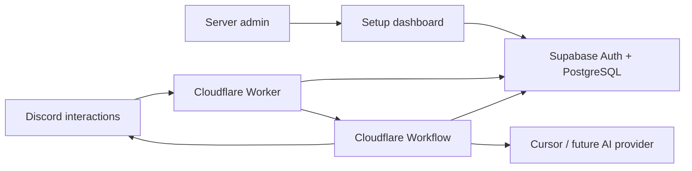

# Discord Agent Bot (Hosted)

One centrally hosted Discord app that lets your team run AI **cloud agents** on
your codebases from Discord. Admins install a single public bot, configure
projects through a web dashboard, and securely bring their own AI-provider keys.

- **Runtime:** Cloudflare Workers (Discord HTTP interactions) + Cloudflare
  Workflows (durable agent runs).
- **Data:** Supabase (Discord OAuth login + PostgreSQL, multi-tenant with RLS).
- **Providers:** provider-neutral layer with a Cursor Cloud Agents adapter today;
  Gemini / OpenAI / Anthropic can be added without touching the core.
- **Security:** signed interactions, encrypted BYOK credentials, per-tenant
  isolation, atomic rate limits, and idempotent command handling.



## Commands

`/agent*` are primary; `/cursor*` are aliases. All are registered globally once.

| Command | Description |
| --- | --- |
| `/agent prompt:<text> [project:<slug>]` | Start a new agent, or continue this channel/thread's agent |
| `/agent-new prompt:<text> [project:<slug>]` | Always start a fresh agent |
| `/agent-status` | Recent agents/runs in this channel or thread |
| `/agent-projects` | Projects you can access |

The channel (or its parent thread) determines the project. A channel with no
mapping falls back to a single guild-wide project, or asks you to pass `project:`.

## Repository layout

```
src/
  worker.ts              # Fetch entry: Discord interactions, admin API, assets
  env.ts                 # Typed bindings + runtime config
  discord/               # Signature verify, interaction types, REST, commands
  bot/                   # Command router + embed builders (no discord.js)
  agents/                # Provider-neutral contracts + registry + cursor adapter
  cursor/                # Cursor Cloud Agents HTTP client + error mapping
  credentials/           # AES-256-GCM envelope encryption + resolver (BYOK)
  db/                    # DataStore/AdminStore interfaces, Supabase + in-memory
  security/              # Pure access control + atomic rate limiting
  admin/                 # Dashboard API routes
  auth/                  # Supabase session -> Discord identity
  workflows/run-agent.ts # Durable launch + poll + message updates
supabase/migrations/     # Schema, RLS, atomic RPCs
dashboard/               # Static onboarding dashboard (served by the Worker)
scripts/register-commands.ts
```

## Deployment

### 1. Supabase

1. Create a Supabase project.
2. Apply the schema: `supabase link` then `npm run db:push` (or paste
   `supabase/migrations/0001_init.sql` into the SQL editor).
3. **Auth → Providers → Discord:** enable it, set the Discord client id/secret,
   and add your dashboard URL to the allowed redirect URLs. Request the `guilds`
   scope so onboarding can verify server management.
4. Note the **Project URL**, **anon key**, and **service-role key**.

RLS is enabled on every table with **no permissive policies**, so the anon and
authenticated keys used in browsers cannot read any row — including encrypted
provider credentials. All tenant-scoped access goes through the Worker using the
service role, which always filters by `org_id`.

### 2. Discord application

1. Create an app in the Discord Developer Portal.
2. Copy the **Public Key**, **Application ID**, **Client Secret**, and the
   **Bot Token**.
3. Set the **Interactions Endpoint URL** to
   `https://<your-worker-domain>/interactions`.
4. Under OAuth2, add your dashboard origin as a redirect for Supabase login.

### 3. Cloudflare

1. Edit `wrangler.toml` `[vars]` with your public values
   (`DISCORD_PUBLIC_KEY`, `DISCORD_APPLICATION_ID`, `DISCORD_CLIENT_ID`,
   `SUPABASE_URL`, `SUPABASE_ANON_KEY`, `PUBLIC_BASE_URL`).
2. Set secrets:
   ```bash
   wrangler secret put DISCORD_BOT_TOKEN
   wrangler secret put DISCORD_CLIENT_SECRET
   wrangler secret put SUPABASE_SERVICE_ROLE_KEY
   wrangler secret put CREDENTIAL_ENCRYPTION_KEYS   # e.g. 1:<base64 32 bytes>
   ```
   Generate an encryption key:
   ```bash
   node -e "console.log('1:'+require('crypto').randomBytes(32).toString('base64'))"
   ```
3. Deploy: `npm run deploy`.
4. Register commands once: `npm run register-commands`
   (reads `DISCORD_APPLICATION_ID` / `DISCORD_BOT_TOKEN` from env or `.dev.vars`).

### 4. Onboarding (per server)

1. Open the dashboard (`PUBLIC_BASE_URL`) and sign in with Discord.
2. Click **Add to Discord** to install the bot on a server you manage.
3. Pick that server, add a **provider key** (encrypted at rest), and create
   **projects** mapping channels/roles to GitHub repos.
4. Team members run `/agent` in the mapped channel.

## Local development

```bash
cp .dev.vars.example .dev.vars   # fill in values
npm install
npm run dev                      # wrangler dev (Worker + Workflows + assets)
```

For Discord to reach your local Worker, expose it (e.g. `cloudflared tunnel`)
and point the Interactions Endpoint URL at the tunnel + `/interactions`.

## How key requirements are met

- **Signed interactions:** every request is Ed25519-verified before parsing
  (`src/discord/verify.ts`); the endpoint answers `PING` and defers within 3s.
- **Durable runs:** launch, polling, retries, and message edits live in a
  Cloudflare Workflow (`src/workflows/run-agent.ts`). Discord interaction ids are
  the workflow idempotency keys; edits use the bot token after the 15-minute
  interaction token expires.
- **BYOK:** provider keys are AES-256-GCM encrypted with versioned master keys
  (rotation-friendly) held only in Cloudflare secrets; decryption happens in
  memory per request (`src/credentials/`).
- **Tenant isolation:** every query is scoped by `org_id`; RLS denies direct
  browser access; guild → org mapping keys all access.
- **Abuse control:** atomic per-user hourly new-agent limit and per-context
  concurrency lock in PostgreSQL.

## Testing

```bash
npm test          # vitest: 41 unit/integration tests
npm run typecheck # tsc --noEmit
```

Covered: Ed25519 verification, encryption + key rotation, provider registry and
factories, access control, atomic rate limiting, idempotency, context locking,
tenant isolation, config validation, and the full command router (defer, access,
BYOK check, rate limit, lock, workflow trigger, idempotency, failure recovery).

## Extending with more providers

Add a `ProviderDefinition` (id, display name, capabilities, `create(credential)`)
in `src/agents/providers/` and register it in `defaultProviderRegistry()`. The
provider-neutral contracts (`src/agents/types.ts`) mean the Worker, Workflow,
storage, and dashboard need no changes.

## License

MIT — see [LICENSE](LICENSE).
